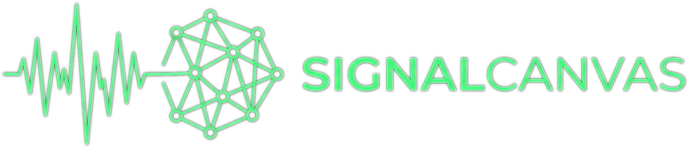

<p align="center">
  
</p>

# PatchLang

A domain-specific language for describing signal flow in broadcast and live production environments. PatchLang defines device templates, physical instances, cable connections, logical signal mappings, and channel configuration.

```
template Rio3224 {
  meta {
    manufacturer: "Yamaha"
    model: "Rio3224"
    category: "Stagebox"
  }
  ports {
    Dante_Pri: io(etherCON) [Dante, primary]
    Mic_In[1..32]: in(XLR)
    Line_Out[1..16]: out(XLR)
  }
  bridge Mic_In -> Dante_Pri
}

instance Stage_Left is Rio3224 {
  location: "Stage Left Wing"
  ip: "192.168.1.31"
}

connect Stage_Left.Dante_Pri -> FOH_Console.Dante_Pri {
  cable: "Cat6a_SL_Pri"
  length: "30m"
}

bridge Stage_Left.Mic_In[1..32] -> FOH_Console.Dante_Ch[1..32]
```

## Why PatchLang?

- **Human-readable** — a 32-channel stagebox is 10 lines, not 200 lines of JSON
- **Git-diffable** — adding a mic input is a one-line diff
- **LLM-friendly** — language models can generate valid `.patch` files from plain English
- **Domain-specific** — models broadcast concepts (ports, connectors, protocols, signal chains) directly

## Language Specification

See [SPEC.md](SPEC.md) for the complete EBNF grammar and syntax reference.

## Installation

### Rust (library)

```toml
[dependencies]
patchlang = { git = "https://github.com/ByteBard97/SignalCanvasLang" }
```

### CLI

```bash
git clone https://github.com/ByteBard97/SignalCanvasLang
cd SignalCanvasLang
cargo install --path crates/patchlang-cli
```

```bash
# Parse a .patch file and output JSON AST
patchlang worship-venue.patch

# Validate via stdin
echo 'instance FOH is CL5' | patchlang
```

### WebAssembly (browser / Node.js)

```bash
./scripts/build-wasm.sh
```

This produces two packages:
- `pkg-node/` — Node.js target
- `pkg-web/` — browser bundler target (Vite, webpack, etc.)

```javascript
import { parse, validate } from './pkg-web/patchlang_wasm.js'

const result = JSON.parse(parse(source))
// result.program  — PatchProgram AST
// result.errors   — array of parse errors (empty if valid)

validate(source)  // returns boolean
```

### Python

```bash
./scripts/build-python.sh
```

```python
import patchlang_python

result = patchlang_python.parse(source)   # returns JSON string
valid = patchlang_python.validate(source) # returns bool
```

## Project Structure

```
SignalCanvasLang/
  crates/
    patchlang/            # Core parser library
      src/
        lexer.rs          # Logos-based tokenizer (44 tokens)
        parser.rs         # Hand-written recursive descent parser
        ast.rs            # Internal AST types
        compat.rs         # TypeScript-compatible serialization
        error.rs          # Error types with byte-offset spans
    patchlang-wasm/       # WebAssembly bindings (wasm-bindgen)
    patchlang-cli/        # Command-line interface
    patchlang-python/     # Python bindings (PyO3)
  tests/
    fixtures/             # Real-world .patch files for testing
    test_wasm.mjs         # WASM smoke tests
    test_python.py        # Python smoke tests
  SPEC.md                 # Formal language specification (EBNF)
```

## Architecture

The parser is a hand-written recursive descent parser using [Logos](https://github.com/logos-rs/logos) for lexing. No parser generator — just Rust functions calling Rust functions.

```
Source text → Logos lexer → Token stream → Recursive descent parser → AST
```

The AST can be serialized two ways:
- **Internal format** — used by CLI and Python bindings
- **TypeScript-compatible format** — used by WASM bindings, matches the frontend's `PatchProgram` type exactly

Error recovery works by skipping to the next top-level keyword when a parse error is encountered. The parser always produces a partial AST alongside any errors.

## Build Targets

| Target | Tool | Output | Use |
|--------|------|--------|-----|
| Rust native | `cargo build` | library | Direct Rust integration |
| CLI binary | `cargo build -p patchlang-cli` | `patchlang` binary | Command-line validation |
| WASM (browser) | `wasm-pack` | `pkg-web/` | Frontend (Vite/webpack) |
| WASM (Node.js) | `wasm-pack` | `pkg-node/` | Server-side JS, testing |
| Python wheel | `maturin` | `.whl` | Django backend (PyO3) |

## Running Tests

```bash
# Rust unit tests (134 tests)
cargo test -p patchlang

# All targets (Rust + WASM + Python)
./scripts/test-all.sh
```

## Part of SignalCanvas

PatchLang is the file format for [SignalCanvas](https://github.com/ByteBard97/SignalCanvas), an infinite-canvas signal flow documentation tool for broadcast and live production engineers. The parser is open source (MIT) so that third-party tools can read and write `.patch` files.

## License

MIT — see [LICENSE](LICENSE).
